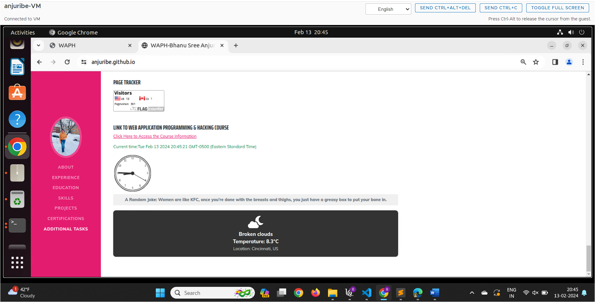
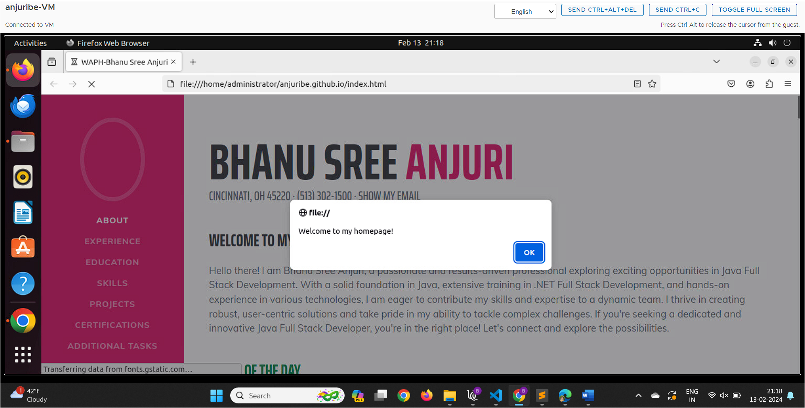
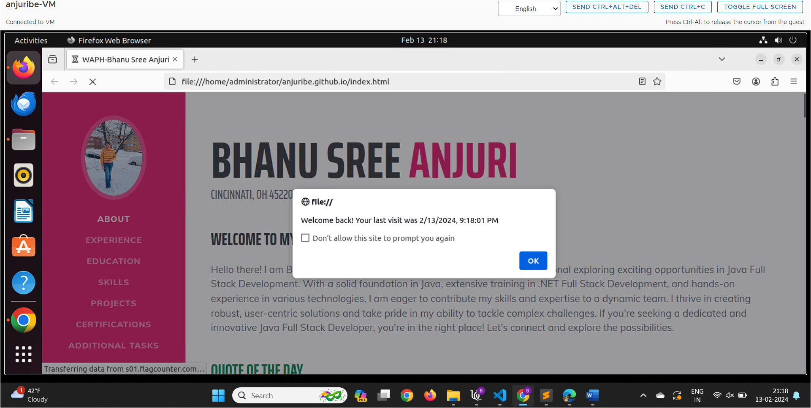

# WAPH-Web Application Programming and Hacking

## Instructor: Dr. Phu Phung

**Name**: Bhanu Sree Anjuri

**Email**: anjuribe@mail.uc.edu

**Short-bio**: I am interested in Software Development and Cyber Security. 


## Repository Information

Respository's URL: [https://github.com/anjuribe/anjuribe.github.io](https://github.com/anjuribe/anjuribe.github.io)

This is a private repository for Bhanu Sree Anjuri to store all code from the
course. The organization of this repository is as follows.

# Individual Project 1
## Front-end Web Development with a Professional Profile Website on github.io cloud service

## Overview 
In this project, we will expand front-end web development skills by developing a Professional Profile Website and deploying it on `github.io` cloud service. This project has general, non-technical, and technical requirements that includes additional tasks like flag counter, API integration and setting cookies. 

For this Project, I have created a public repository that can be accessed through [https://github.com/anjuribe/anjuribe.github.io](https://github.com/anjuribe/anjuribe.github.io)

# General Requirements

Firstly, I have created a public repository with the name anjuribe.github.io. Then I have created a html file with name `waph.html`. This file includes the course information and the overviews of Completed Labs, Hackathons and Individual Projects. This website can be accessed through [https://anjuribe.github.io/waph.html](https://anjuribe.github.io/waph.html)

I have cloned this public repository to my virtual box by generating personal access token in github.


After cloning,n I have created a html file `idex.html` for my personal website on Github cloud as a professional profile to add to my resume. This website can be accessed through [https://anjuribe.github.io/](https://anjuribe.github.io/)

My professional website includes the following sections:
1. About
2. Experience
3. Education
4. Skills
5. Projects
6. Certifications
7. Additional Skills

For creating this website , I have used a open source bootstrap template that is suitable for a portfolio. I have modified the styling and the template based on my requirements. 


This webpage has a Navigation bar that helps in navigating to all the sections which I have created. 

The following is the code for this section of the page:

```<nav class="navbar navbar-expand-lg navbar-dark bg-primary fixed-top" id="sideNav">```
        `<a class="navbar-brand js-scroll-trigger" href="#page-top">
            <span class="d-block d-lg-none">Bhanu Sree Anjuri</span>
            <span class="d-none d-lg-block"></span>
        </a>`
        `<button class="navbar-toggler" type="button" data-bs-toggle="collapse" data-bs-target="#navbarResponsive"
            aria-controls="navbarResponsive" aria-expanded="false" aria-label="Toggle navigation"><span
                class="navbar-toggler-icon"></span></button>`
        `<div class="collapse navbar-collapse" id="navbarResponsive">`
            ```<ul class="navbar-nav">
                <li class="nav-item"><a class="nav-link js-scroll-trigger" href="#about">About</a></li>
                <li class="nav-item"><a class="nav-link js-scroll-trigger" href="#experience">Experience</a></li>
                <li class="nav-item"><a class="nav-link js-scroll-trigger" href="#education">Education</a></li>
                <li class="nav-item"><a class="nav-link js-scroll-trigger" href="#skills">Skills</a></li>
                <li class="nav-item"><a class="nav-link js-scroll-trigger" href="#projects">Projects</a></li>
                <li class="nav-item"><a class="nav-link js-scroll-trigger" href="#certifications">Certifications</a></li>
                <li class="nav-item"><a class="nav-link js-scroll-trigger" href="#Additional_Tasks">Additional Tasks</a></li>
            </ul>```
        </div>
`</nav>`

Which you can find this in the above screenshot also.

Next part of the website is followed by creating sections for each section and mapping it to the navigation bar. 

At last this webpage icncludes all the additional tasks required for this project. 

Apart from the General Requirements, I have linked the `waph.html` file in the main page using `<a>` tag. 

# Non-Technical Requirements
Next, for the Non-technical Requirements:

1. I have used an open source bootstrap template. 
2. Included a Page tracker, i.e flag counter, which notes the visits of the page and countries where this page has been opened. 

# Technical Requirements

Coming to the Technical Requirements:

1. I have used the jQuery and Java Script code introduced in Lab 2 for displaying Digital Clock, Analog Clock, Show/Hide My Email. 
2.  For Another Functonality of my Choice, I have used an open source js framework Vue for an additional functionality. I have integrated a public API for fetching a random Quote for every 12 hours and gets a new quote whenever the page is loaded. 

The Code for this functionality is in the script tag:


        new Vue({
            el: '#app',
            data: {
                quote: {
                    content: '',
                    originator: {
                        name: ''
                    }
                }
            },
            methods: {
                async fetchQuote() {
                    const options = {
                        method: 'GET',
                        url: 'https://random-quote-generator2.p.rapidapi.com/randomQuote',
                        headers: {
                            'X-RapidAPI-Key': 'b9b5a91c2emsh000a90d32a87145p1c5729jsne626d5f90d25',
                            'X-RapidAPI-Host': 'random-quote-generator2.p.rapidapi.com'
                        }
                    };
                    try {
                        const response = await axios.request(options);

                        if (Array.isArray(response.data) && response.data.length > 0) {
                            const quote = response.data[0];

                            this.quote.content = quote.Quote;
                            this.quote.originator.name = quote.Author;
                        } else {
                            console.error('Invalid data received from the API:', response.data);
                        }
                    } catch (error) {
                        console.error(error);
                    }
                }
            },
            created() {
                // Fetch a quote when the app is created
                this.fetchQuote();

                // Fetch a new quote every 12 hours
                setInterval(this.fetchQuote, 12 * 60 * 60 * 1000);
            }
        });

Code in HTML to display the Quote:

`<div class="mt-5">`
    ```<p>
    <h3 class="text-success">Quote of the day</h3>
    <strong>"{{ quote.content }}"</strong>
    <span style="font-weight: bold;"> - {{ quote.originator.name }}</span>
    </p>```
`</div>`

This functionality is inserted in the home page of the website. 

Next, I have integrated 2 public webAPI's into my website.

They are:

1. Integrated the joke API [https://v2.jokeapi.dev/joke/Any](https://v2.jokeapi.dev/joke/Any) to display any random joke into the website and displays a new joke for every minute. For this calling, I have set interval for calling the function every minute. 

Code:

`function getJoke() {
            $.get("https://v2.jokeapi.dev/joke/Any?type=single", function (result) {
                $("#response").html("A Random Joke: " + result.joke);
            });
        }
setInterval(getJoke, 60000);
getJoke();`

2. Integrated a public API which is to display the current weather using `https://www.weatherbit.io`. I have generated a API Key and integrated it into my website with all the JSON data returned from the API to display the data I have styled it using CSS and displayed the Temperature, Icon, Location and the weather description. 



Additionally, as per the requirement, I have set cookies to remember the user, So, for the first time a pop up will be displayed saying Welcome to my Home page, and for the next visit it displays a pop up saying Welcome back and the date and time when the user have visited last. 




Along with the report, I have attached the Source Code and the website as pdf. 

